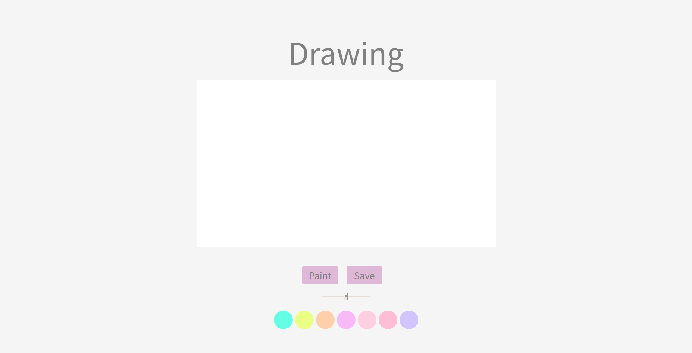

# Drawings
javascript canvas API ex project.
developed with Vanilla JS.

## Preview

## Features
- Drawing something (Line)
- Fill canvas (Paint tool)
- Save image to local
- Change brush size
- Change color

